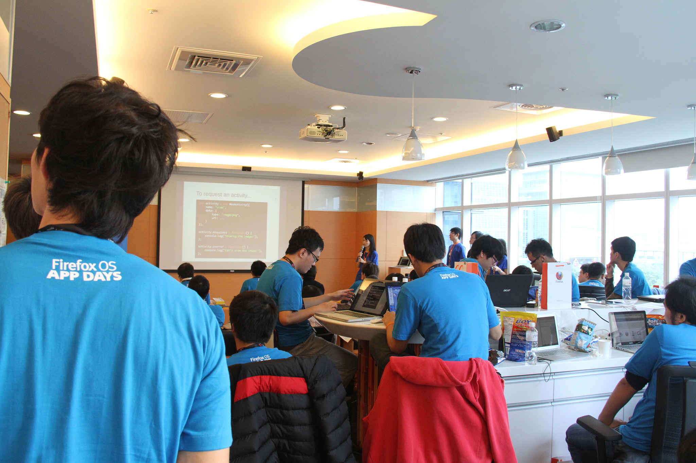
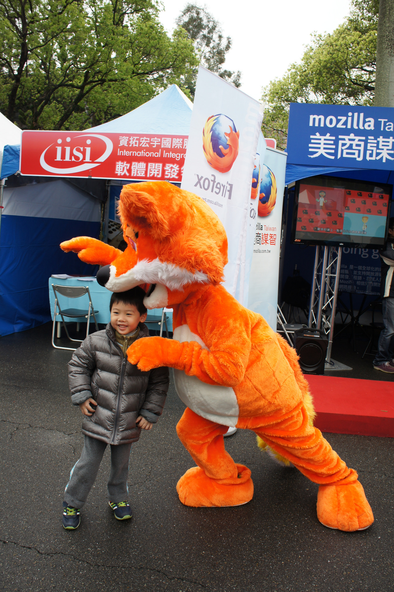
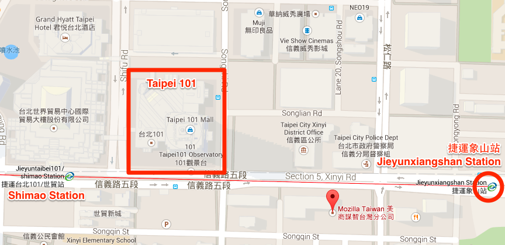
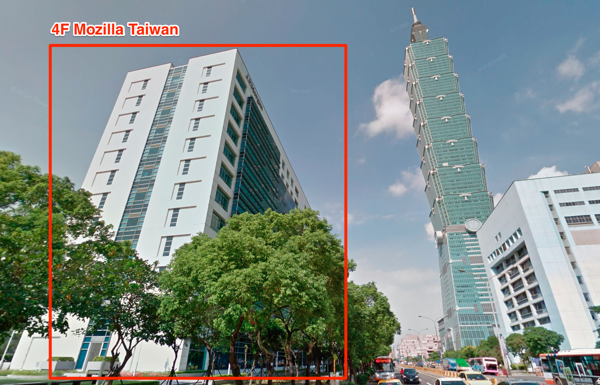

Little thing about Mozilla Taiwan, opinionated
---------------------------------------------

### Welcome to Mozilla Taiwan!

#### What we do in Taiwan includes:

Building Firefox OS,

Eating human, and

Fighting Kaiju

#### How to get here if you feel like a little tour in the neighborhood:
#### (We'd also like to pick you up for your convenience!)

The location:

The building MozTW located looks like

[Google Street View](http://goo.gl/maps/9NBlV)

#### Things to do nearby:

Base jump from Taipei 101

After jumping you'd probably be [banned from entering Taiwan...](http://www.chinapost.com.tw/taiwan/2007/12/14/134820/Austrian-BASE.htm)

View from above, 40mins to 1 hour walk from MozTW

Sun Yat-sen Memorial Hall

